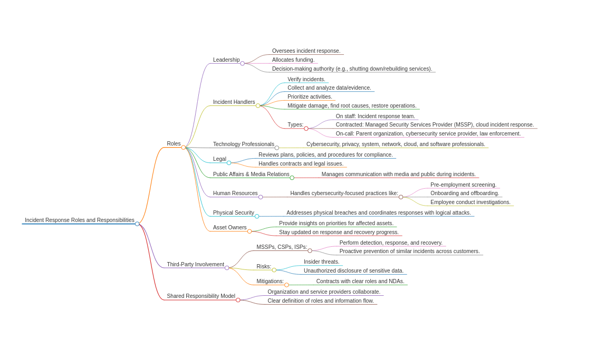

# SNOW -Teams

Rsource Visualiser&#x20;

<figure><figcaption></figcaption></figure>

Logic App Flows&#x20;

<figure><figcaption></figcaption></figure>

<figure><figcaption></figcaption></figure>

Components Settings&#x20;

1.  MS Sentinel &#x20;

    <figure><figcaption></figcaption></figure>
2.  adaptiveCardItems

    <figure><figcaption></figcaption></figure>
3.  Extract entities and add to adaptive card -4 actions&#x20;

    <figure><figcaption></figcaption></figure>
4.  SNOW- Query for sentinel Incident Number

    <figure><figcaption></figcaption></figure>
5.  Check to see if SNOW Incident Exists - 2 cases

    <figure><figcaption></figcaption></figure>

    Function&#x20;

    ```templateexpressionlanguage
    length(body('ServiceNow_-_Query_for_Sentinel_Incident_Number')?['result'])
    ```
6. Compose Teams Incident Alert Card&#x20;

```json
// Some code
{
  "$schema": "http://adaptivecards.io/schemas/adaptive-card.json",
  "actions": [
    {
      "title": "Open Incident in Sentinel",
      "type": "Action.OpenUrl",
      "url": "@{triggerBody()?['object']?['properties']?['incidentUrl']}"
    },
    {
      "style": "destructive",
      "title": "Open Service Now Incident",
      "type": "Action.OpenUrl",
      "url": "https://ven03842.service-now.com/nav_to.do?uri=/incident_list.do?sysparm_query=active=true"
    }
  ],
  "body": [
    {
      "color": "accent",
      "size": "large",
      "text": "Microsoft Sentinel Alert - @{triggerBody()?['object']?['properties']?['incidentNumber']} - @{triggerBody()?['object']?['properties']?['title']} ",
      "type": "TextBlock",
      "wrap": true
    },
    {
      "items": @{variables('adaptiveCardItems')},
      "spacing": "padding",
      "style": "default",
      "type": "Container"
    }
  ],
  "msTeams": {
    "width": "full"
  },
  "type": "AdaptiveCard",
  "version": "1.2"
}
```

<figure><figcaption></figcaption></figure>

7.  Post Incident in SOC Alerts Channel&#x20;

    <figure><figcaption></figcaption></figure>
8.  Post Actions Required in Investigation Request channel

    <figure><figcaption></figcaption></figure>


```json
// Message
{
    "msTeams": {
        "width": "full"
    },
    "$schema": "http://adaptivecards.io/schemas/adaptive-card.json",
    "type": "AdaptiveCard",
    "version": "1.2",
    "body": [
					{
						"type": "TextBlock",
						"size": "large",
						"color": "accent",
						"text": "**Microsoft Sentinel Alert - **@{triggerBody()?['object']?['properties']?['incidentNumber']} - @{triggerBody()?['object']?['properties']?['title']}",
						"wrap": true
					},
        {
            "type": "TextBlock",
            "text": "Please Select the playbooks to run for the incident:",
            "weight": "Bolder"
        },
        {
            "type": "TextBlock",
            "text": "Available tagged Logic App playbooks",
            "wrap": true,
            "weight": "Bolder",
            "color": "Accent"
        },
        {
            "type": "Input.ChoiceSet",
            "choices": @{body('LogicApp_-_Get_tagged_playbooks')},
            "placeholder": "IP Playbooks",
            "isMultiSelect": true,
            "style": "expanded",
            "id": "playbooks"
        }
    ],
    "actions": [
        {
            "type": "Action.Submit",
            "title": "Submit"
        }
    ]
}
```

7.  Update incident thread from investigation Response&#x20;

    <figure><figcaption></figcaption></figure>
8.  SNOW update Record with response from user&#x20;

    <figure><figcaption></figcaption></figure>
9.  Grab Selected playbooks from investigation response&#x20;

    <figure><figcaption></figcaption></figure>


```json
// value
split(body('Post_Actions_Required_in_Investigation_Requests_Channel')?['data']?['playbooks'],',')
```

7.  Loop though each playbook and run it -5 actions

    <figure><figcaption></figcaption></figure>

<figure><figcaption></figcaption></figure>

Loop through :-

1. find playbook based on playbook name provided&#x20;

<figure><figcaption></figcaption></figure>

```templateexpressionlanguage
From 
array(body('LogicApp_-_Get_tagged_playbooks'))
```

2.

    <figure><figcaption></figcaption></figure>

URI&#x20;

```templateexpressionlanguage
body('Find_playbook_based_on_playbook_name_provided')[0]?['callbackUrl']
```

3.  Teams Reply Text

    <figure><figcaption></figcaption></figure>
4. SNOW add additional comments in SNOW ticket&#x20;

<figure><figcaption></figcaption></figure>

5. MS Sentinel Add comment to releated Incident&#x20;

<figure><figcaption></figcaption></figure>

&#x20;Section : 5 Check If SNOW Incident Exist

<figure><figcaption></figcaption></figure>

True:&#x20;

<figure><figcaption></figcaption></figure>

value:&#x20;

```templateexpressionlanguage
body('ServiceNow_-_Query_for_Sentinel_Incident_Number')?['result'][0]?['sys_id']
```

False :

<figure><figcaption></figcaption></figure>

<figure><figcaption></figcaption></figure>

<figure><figcaption></figcaption></figure>

Section 3: Extract Entities and add to adaptive card&#x20;

<figure><figcaption></figcaption></figure>

<figure><figcaption></figcaption></figure>

<figure><figcaption></figcaption></figure>

<figure><figcaption></figcaption></figure>

From&#x20;

```templateexpressionlanguage
array(triggerBody()?['object']?['properties']?['relatedEntities'])
```

<figure><figcaption></figcaption></figure>

<figure><figcaption></figcaption></figure>

```templateexpressionlanguage
length(body('Filter_list_by_each_type_name'))
```

<figure><figcaption></figcaption></figure>

<figure><figcaption></figcaption></figure>

<figure><figcaption></figcaption></figure>

### SNOW Team -IPCheckon VT

<figure><figcaption></figcaption></figure>

<figure><figcaption></figcaption></figure>

<figure><figcaption></figcaption></figure>

from&#x20;

```templateexpressionlanguage
array(triggerBody()?['object']?['properties']?['relatedEntities'])
```

<figure><figcaption></figcaption></figure>

<figure><figcaption></figcaption></figure>

<figure><figcaption></figcaption></figure>
